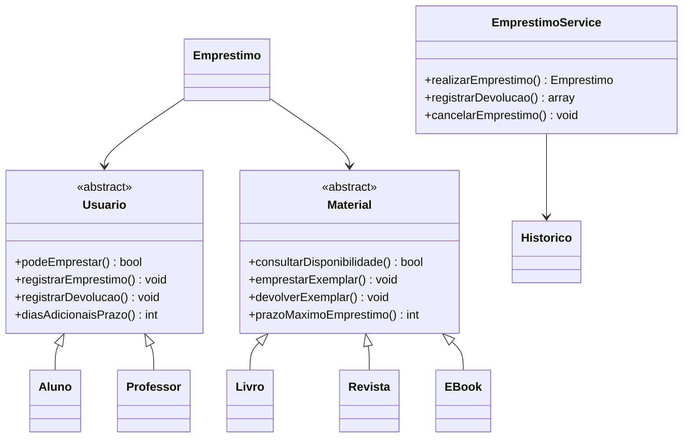

# Diagrama de Classes UML

```mermaid
classDiagram
    Material <|-- Livro
    Material <|-- Revista
    Material <|-- EBook
    Usuario <|-- Aluno
    Usuario <|-- Professor
    Emprestimo --> Usuario
    Emprestimo --> Material
    EmprestimoService --> Historico
    class Material {
      <<abstract>>
      +consultarDisponibilidade() bool
      +emprestarExemplar() void
      +devolverExemplar() void
      +prazoMaximoEmprestimo() int
    }
    class Usuario {
      <<abstract>>
      +podeEmprestar() bool
      +registrarEmprestimo() void
      +registrarDevolucao() void
      +diasAdicionaisPrazo() int
    }
    class EmprestimoService {
      +realizarEmprestimo() Emprestimo
      +registrarDevolucao() array
      +cancelarEmprestimo() void
    }
```
